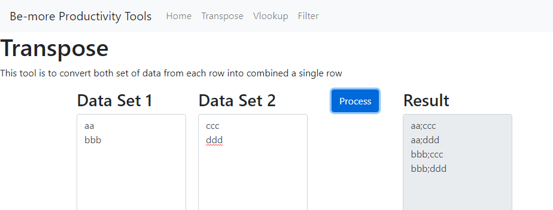
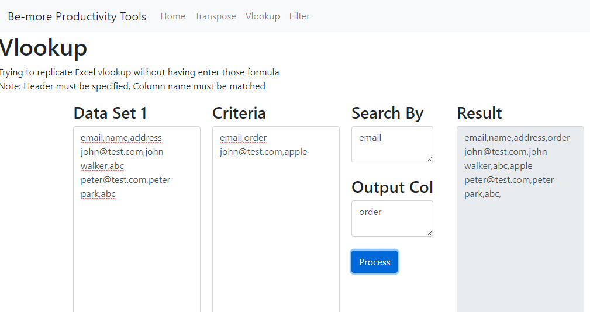
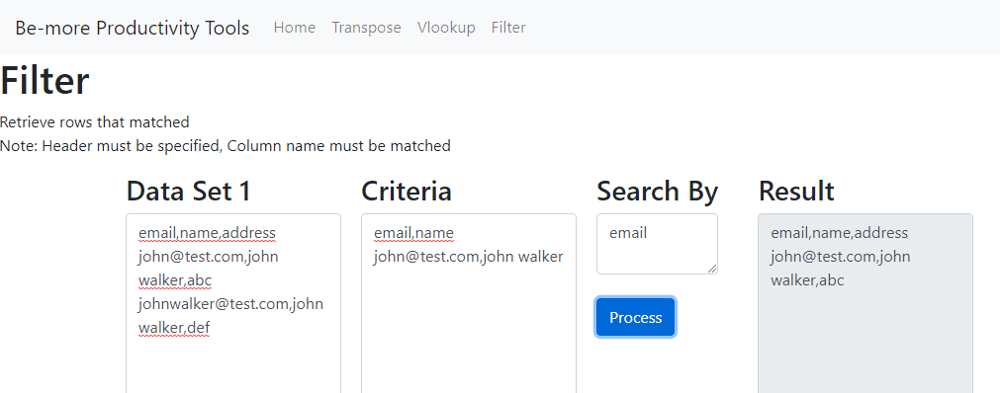

# Be-more Productivity Tools

An application that helps to improve productivity with simple in-built functionalities.

## Project Setup & Commands

### Install required modules

```shell
npm install
```

### Compiles, starts up local server for Storybook development

```shell
npm run storybook
```

### Run unit tests

```shell
npm test
```

### Execute in web app locally

```shell
npm start
```

### Execute in desktop app locally

```shell
npm run electron-dev
```

### Build to desktop binary

```shell
npm run electron-pack
```

## Current version

* A Web app
* A Desktop app powered by electron

## Features

### Transpose



### Vlookup



### Fliter



## Impetus

I always find it difficult to use Excel's Vlookup and sometimes as a developer, i might need to manipuate data like flitering so i built this application is for my own convenience to help me manipulate data easily as well as learning React and as well as exploring Electron.
